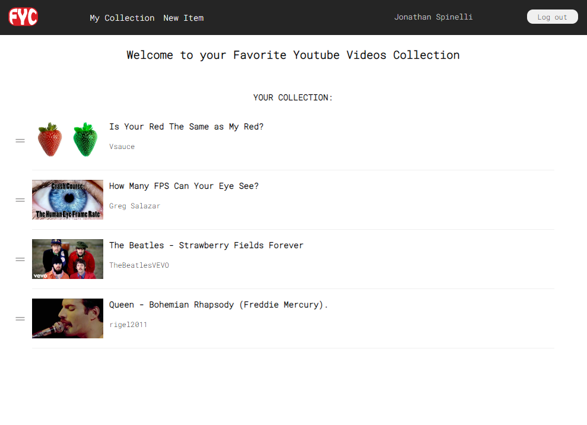

# FAVORITE YOUTUBE VIDEO COLLECTION (FYC)

This is an app I created for exploring Ruby on Rails developing techniques and sharing some of what I've been learning.

 

App features:

* Ruby 3.1.2

* Rails 7

* OAuth2 authentication (twitter, google and facebook) via [Omniauth](https://omniauth.org/)

* MongoDB Atlas integration via [Mongoid gem 7.4](https://rubygems.org/gems/mongoid/versions/7.4.0)

* YoutubeAPI communcation

 

## It's live!

You can find the app running at [Heroku](https://enigmatic-everglades-73136.herokuapp.com/).

 

## What does it do?

In this app, users are able to store a collection of their favorite youtube videos just by providing the video urls.

The app only stores the video IDs and communicate with YoutubeAPI for getting the appropriate information (video title, thumbnail url and channel) when needed for displaying the collection.

The collection page looks like this:

At anytime users can delete a video from the collection.

 

### Links validation

Javascripts handle the link validation and only enable the 'add' button (on 'New item' page, not shown in the image above) when provided links are valid.

